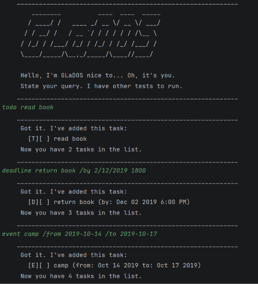
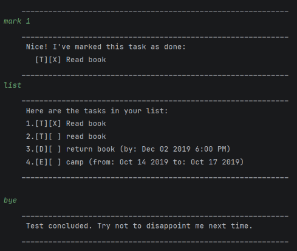

# GLaDOS User Guide





GLaDOS is a command line chatbot that keeps track of your tasks: things to do,
deadlines, and events. You type a command, and GLaDOS replies (with the
enthusiasm of a computer that would rather be running other tests).

- [Quick start](#quick-start)
- [Features](#features)
  - [Adding a todo: `todo`](#adding-a-todo-todo)
  - [Adding a deadline: `deadline`](#adding-a-deadline-deadline)
  - [Adding an event: `event`](#adding-an-event-event)
  - [Listing all tasks: `list`](#listing-all-tasks-list)
  - [Marking a task as done or not done: `mark`, `unmark`](#marking-a-task-as-done-or-not-done-mark-unmark)
  - [Deleting a task: `delete`](#deleting-a-task-delete)
  - [Finding tasks by keyword: `find`](#finding-tasks-by-keyword-find)
  - [Listing the tasks on a date: `on`](#listing-the-tasks-on-a-date-on)
  - [Exiting: `bye`](#exiting-bye)
  - [Saving the data](#saving-the-data)
  - [Editing the data file](#editing-the-data-file)
- [Known issues](#known-issues)
- [Command summary](#command-summary)

## Quick start

1. Make sure Java 25 is installed. To check, run `java -version` in a
   terminal; it should report version 25.
2. Download the latest `glados.jar` from the
   [releases page](https://github.com/SwaggyDaddy67/ip/releases).
3. Copy the file into an empty folder where you want GLaDOS to keep your
   tasks.
4. Open a terminal, go to that folder (e.g. `cd glados`), and run:
   ```
   java -jar glados.jar
   ```
5. Type a command and press Enter. Some to try:
   - `todo read book` adds a todo.
   - `deadline return book /by 2019-12-02` adds a deadline.
   - `list` shows all your tasks.
   - `bye` exits.

See [Features](#features) for every command.

## Features

> **Notes about the command format**
>
> - Words in `UPPER_CASE` are what you fill in. In `todo DESCRIPTION`,
>   replace `DESCRIPTION` with e.g. `read book`.
> - Items in square brackets are optional. `/by DATE [TIME]` can be
>   `/by 2019-12-02` or `/by 2019-12-02 1800`.
> - Command words and the `/by`, `/from`, and `/to` markers are lowercase:
>   `todo` works, `TODO` does not.
> - Parameters must be in the order shown: `/by` comes after the
>   description, and `/from` comes before `/to`.
> - `list` and `bye` must be typed on their own, with nothing after them.
> - `TASK_NUMBER` is the number shown next to a task in `list`.
> - The `|` character cannot be used in a task, since GLaDOS uses it in its
>   data file.
> - If a command is not typed correctly, GLaDOS says what is wrong, usually
>   with an example of the right format, and your tasks are left unchanged.

> **Dates and times**
>
> - A `DATE` is written as `yyyy-mm-dd` (e.g. `2019-12-02`) or `d/m/yyyy`,
>   day first (e.g. `2/12/2019`). Both mean 2 December 2019.
> - A `TIME` is optional and uses the 24-hour clock, with no colon
>   (e.g. `1800` for 6pm, `0930` for 9:30am).
> - GLaDOS shows dates as e.g. `Dec 02 2019`, or `Dec 02 2019 6:00 PM` with a
>   time.
> - Dates that do not exist, such as `2019-02-30`, are rejected. So are
>   two-digit years (`2/12/19`) and one-digit months or days in the
>   `yyyy-mm-dd` form (`2019-1-5`; write `2019-01-05`).

### Adding a todo: `todo`

Adds a task with no date.

Format: `todo DESCRIPTION`

Example: `todo read book`

GLaDOS adds the todo to the end of your list and says how many tasks you now
have:

```
    ____________________________________________________________
     Got it. I've added this task:
       [T][ ] read book
     Now you have 1 tasks in the list.
    ____________________________________________________________
```

### Adding a deadline: `deadline`

Adds a task that must be done by a certain date, and optionally a time.

Format: `deadline DESCRIPTION /by DATE [TIME]`

Examples:
- `deadline return book /by 2/12/2019 1800`
- `deadline submit report /by 2019-10-15`

GLaDOS adds the deadline, shows its date in a friendlier form, and says how
many tasks you now have. For the first example:

```
    ____________________________________________________________
     Got it. I've added this task:
       [D][ ] return book (by: Dec 02 2019 6:00 PM)
     Now you have 2 tasks in the list.
    ____________________________________________________________
```

### Adding an event: `event`

Adds a task that starts and ends at certain dates, and optionally times.

Format: `event DESCRIPTION /from DATE [TIME] /to DATE [TIME]`

- An event can last several days.
- An event cannot end before it starts.
- A date without a time counts as the whole day, so
  `/from 2019-10-15 1800 /to 2019-10-15` is accepted.

Examples:
- `event project meeting /from 2019-10-15 1400 /to 2019-10-15 1600`
- `event camp /from 2019-10-14 /to 2019-10-17`

GLaDOS adds the event, shows when it starts and ends, and says how many tasks
you now have. For the first example:

```
    ____________________________________________________________
     Got it. I've added this task:
       [E][ ] project meeting (from: Oct 15 2019 2:00 PM to: Oct 15 2019 4:00 PM)
     Now you have 3 tasks in the list.
    ____________________________________________________________
```

### Listing all tasks: `list`

Shows every task, numbered.

Format: `list`

Example: `list`

GLaDOS lists your tasks in the order you added them. Each task shows its type
(`[T]` todo, `[D]` deadline, `[E]` event), then `[X]` if it is done or `[ ]`
if it is not:

```
    ____________________________________________________________
     Here are the tasks in your list:
     1.[T][ ] read book
     2.[D][ ] return book (by: Dec 02 2019 6:00 PM)
     3.[E][ ] project meeting (from: Oct 15 2019 2:00 PM to: Oct 15 2019 4:00 PM)
     4.[E][ ] camp (from: Oct 14 2019 to: Oct 17 2019)
    ____________________________________________________________
```

### Marking a task as done or not done: `mark`, `unmark`

Marks a task as done, or back to not done.

Format: `mark TASK_NUMBER`, `unmark TASK_NUMBER`

Examples: `mark 1` marks the first task in `list` as done, and `unmark 1`
marks it as not done again.

GLaDOS shows the task with its new status:

```
    ____________________________________________________________
     Nice! I've marked this task as done:
       [T][X] read book
    ____________________________________________________________
    ____________________________________________________________
     OK, I've marked this task as not done yet:
       [T][ ] read book
    ____________________________________________________________
```

### Deleting a task: `delete`

Removes a task from the list for good. Every task after it moves up by one,
so check `list` before deleting again.

Format: `delete TASK_NUMBER`

Example: `delete 2`

GLaDOS shows the task it removed and says how many tasks are left:

```
    ____________________________________________________________
     Noted. I've removed this task:
       [D][ ] return book (by: Dec 02 2019 6:00 PM)
     Now you have 3 tasks in the list.
    ____________________________________________________________
```

### Finding tasks by keyword: `find`

Shows every task whose description contains the keyword.

Format: `find KEYWORD`

- Upper and lower case are ignored: `find BOOK` finds `read book`.
- The keyword can be part of a word: `find boo` finds `book`.
- The keyword can contain spaces, and is matched as a whole:
  `find return book` finds `return book` but not `read book`.
- Only descriptions are searched. To search by date, use [`on`](#listing-the-tasks-on-a-date-on).
- If no task matches, GLaDOS says so.

Example: `find book`

GLaDOS lists every matching task:

```
    ____________________________________________________________
     Here are the matching tasks in your list:
     1.[T][ ] read book
     2.[D][ ] return book (by: Dec 02 2019 6:00 PM)
    ____________________________________________________________
```

The numbers here count the matches, not positions in `list`. Use `list` to
find a task's number before you `mark` or `delete` it.

### Listing the tasks on a date: `on`

Shows the deadlines due on a date, and the events running on it.

Format: `on DATE`

- An event that lasts several days appears on every day it covers.
- Give a date only, with no time, since this asks about the whole day.
- As with `find`, the numbers count the results, not positions in `list`.
- If nothing falls on that date, GLaDOS says so.

Example: `on 2019-10-15`

GLaDOS lists the deadlines and events on that day. Here the camp appears
because it runs from Oct 14 to Oct 17:

```
    ____________________________________________________________
     Here are the tasks on Oct 15 2019:
     1.[E][ ] project meeting (from: Oct 15 2019 2:00 PM to: Oct 15 2019 4:00 PM)
     2.[E][ ] camp (from: Oct 14 2019 to: Oct 17 2019)
    ____________________________________________________________
```

### Exiting: `bye`

Ends the conversation and closes GLaDOS.

Format: `bye`

Example: `bye`

GLaDOS says goodbye and closes. Your tasks are already saved:

```
    ____________________________________________________________
     Test concluded. Try not to disappoint me next time.
    ____________________________________________________________
```

### Saving the data

GLaDOS saves your tasks automatically after every change, and loads them
again the next time it starts. There is no need to save manually.

Tasks are saved in `data/glados.txt`, inside the folder your terminal is in
when you start GLaDOS. That is the folder with `glados.jar` if you followed
the [Quick start](#quick-start). The folder and file are created the first
time you add a task. To move your tasks to another computer, copy the `data`
folder into the folder you start GLaDOS from there.

> **Tip:** always start GLaDOS from the same folder. Starting it from
> another folder gives you a separate, empty task list there.

### Editing the data file

Advanced users can edit `data/glados.txt` directly, in any text editor. Each
line is one task, with fields separated by ` | `:

```
T | 0 | read book
D | 1 | return book | 2019-12-02 1800
E | 0 | camp | 2019-10-14 | 2019-10-17
```

- The first field is the type: `T`, `D`, or `E`.
- The second is `1` if the task is done, or `0` if not.
- Then come the description and, for deadlines and events, the dates.
- In the file, dates are always `yyyy-mm-dd`, optionally followed by a
  24-hour time, e.g. `2019-12-02 1800`.
- Save the file as UTF-8, which most editors do by default. A line with a
  character saved in another encoding, such as an `é` from an older Windows
  editor, cannot be read.

> **Caution:** if a line is not in this format, GLaDOS skips it at startup
> and warns you how many lines it skipped. Skipped lines are removed the next
> time GLaDOS saves. Back up the file before editing it.

## Known issues

- In a deadline's description, a word starting with `/by` (such as
  `/bytes`) is mistaken for the `/by` marker. The same happens in an event's
  description with words starting with `/from` or `/to` (such as `/today`).
  The task is then rejected with an error. Leave out the `/` in that word to
  add the task, e.g. `deadline buy bytes /by 2019-10-15`.
- In a hand-edited data file, a line with an extra space around a field,
  such as a space after the date, cannot be read. GLaDOS warns about it at
  startup.
- `mark` on a task that is already done says it was marked as done again,
  without saying it was already done. The task is unaffected.

## Command summary

| Action | Format and example |
|---|---|
| Add a todo | `todo DESCRIPTION`<br>e.g. `todo read book` |
| Add a deadline | `deadline DESCRIPTION /by DATE [TIME]`<br>e.g. `deadline return book /by 2/12/2019 1800` |
| Add an event | `event DESCRIPTION /from DATE [TIME] /to DATE [TIME]`<br>e.g. `event camp /from 2019-10-14 /to 2019-10-17` |
| List all tasks | `list` |
| Mark as done | `mark TASK_NUMBER`<br>e.g. `mark 1` |
| Mark as not done | `unmark TASK_NUMBER`<br>e.g. `unmark 1` |
| Delete | `delete TASK_NUMBER`<br>e.g. `delete 2` |
| Find by keyword | `find KEYWORD`<br>e.g. `find book` |
| List tasks on a date | `on DATE`<br>e.g. `on 2019-10-15` |
| Exit | `bye` |
